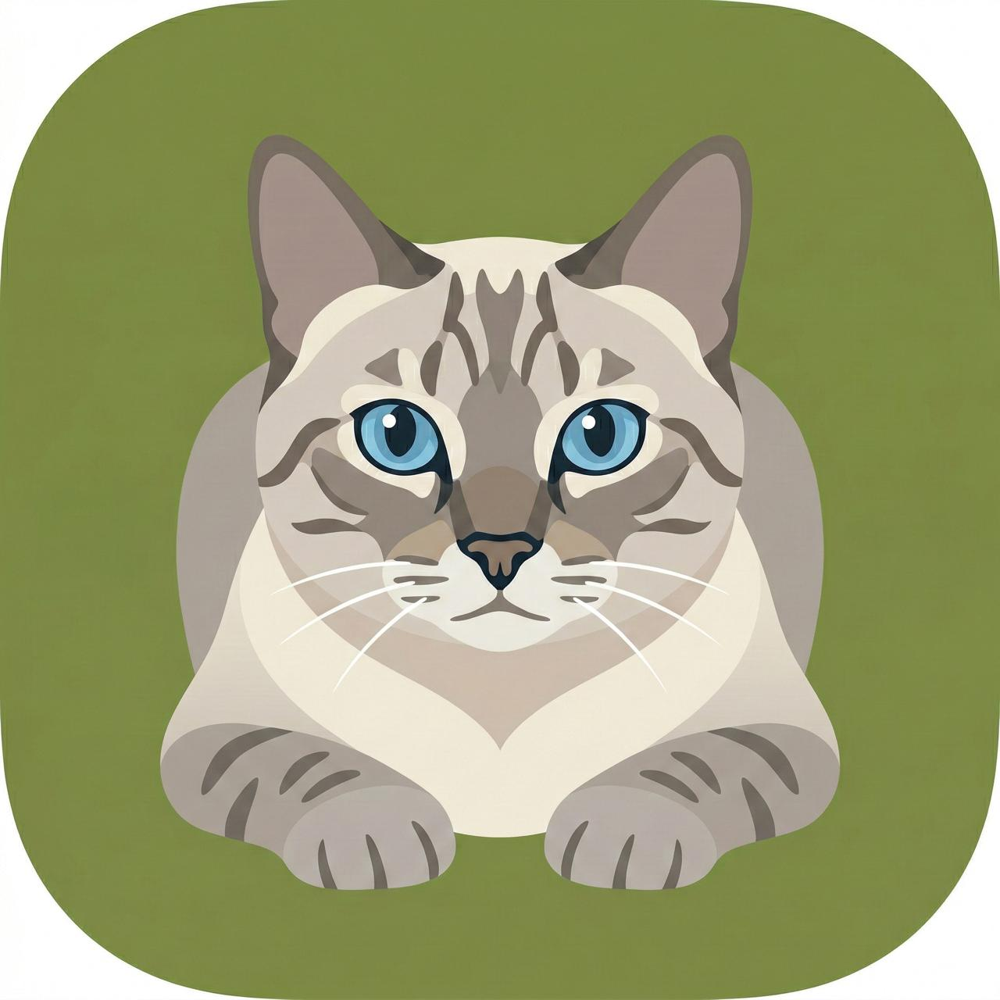

# Frajola

<p align="center">
  
</p>

<p align="center">
  <strong>Free, cross-platform meeting recorder with transcription and AI-powered notes.</strong><br>
  No bots. Privacy-first.
</p>

**Website:** [frajola.app](https://frajola.app)

**Inspired by [Amie](https://amie.so)** - the elegant AI note taker with notch UI.

## What is Frajola?

Frajola is a desktop app that records your meetings directly from your computer's audio output and microphone - no need to invite a bot to your calls. It works with any meeting platform (Zoom, Google Meet, Teams, etc.) and generates transcripts and meeting notes automatically.

Think **Amie, but free and cross-platform**.

## Why Frajola?

| Feature | Frajola | Amie | Jamie | Otter.ai |
|---------|---------|------|-------|----------|
| Price | **Free** | Paid | $24/mo | $16.99/mo |
| No Meeting Bot | ✅ | ✅ | ✅ | ⚠️ |
| Windows | ✅ | ❌ | ✅ | ✅ |
| macOS | ✅ | ✅ | ✅ | ✅ |
| Linux | ✅ | ❌ | ❌ | ❌ |
| Floating UI | ✅ | ✅ (notch) | ❌ | ❌ |
| AI Chat | ✅ | ✅ | ❌ | ⚠️ |
| Open Source | ✅ | ❌ | ❌ | ❌ |

## Features

### MVP (v1.0)
- [ ] Record system audio + microphone simultaneously
- [ ] Floating UI / mini player (like Amie's notch)
- [ ] Pause/resume recording (speak "off the record")
- [ ] Auto-detect meeting start/end
- [ ] Generate transcript with speaker diarization
- [ ] AI-powered meeting summary and action items
- [ ] Export to Markdown, PDF, or plain text
- [ ] **Multilingual:** English + Português Brasileiro

### v2.0 (Planned)
- [ ] **AI Chat** - Ask questions about any past meeting
- [ ] **Local LLM** - Run AI 100% offline (Ollama, llama.cpp)
- [ ] **Calendar integration** - Google, Outlook
- [ ] **Smart recordings** - Auto-record scheduled meetings
- [ ] **Speaker memory** - Remember names across meetings
- [ ] **Shareable pages** - Share notes with team/clients

### v3.0 (Future)
- [ ] **Integrations** - Notion, Slack, Linear, Hubspot
- [ ] **Email drafts** - AI-generated follow-ups
- [ ] **Meeting insights** - Analytics across all meetings
- [ ] **Team workspace** - Collaboration features

## Tech Stack

- **Framework:** Electron
- **Frontend:** React + TypeScript
- **Audio Capture:** Native system audio loopback
- **Transcription:** Whisper (local via whisper.cpp) or API
- **AI Notes:** Local LLM (Ollama) or Cloud (GPT/Claude)
- **Database:** SQLite (local)

### Privacy Modes

| Mode | Transcription | AI Notes | Data Sent |
|------|---------------|----------|-----------|
| **Full Local** | Whisper.cpp | Ollama | None ✅ |
| **Hybrid** | Whisper.cpp | GPT/Claude API | Transcript only |
| **Cloud** | Whisper API | GPT/Claude API | Audio + Transcript |

## Getting Started

```bash
# Clone the repository
git clone https://github.com/victorlucss/frajola.git
cd frajola

# Install dependencies
npm install

# Run in development
npm run dev

# Build for production
npm run build
```

## Documentation

- [Product Requirements](./docs/PRD.md)
- [Competitive Analysis](./docs/COMPETITIVE_ANALYSIS.md)
- [Architecture](./docs/ARCHITECTURE.md)
- [Tech Research](./docs/TECH_RESEARCH.md)

## License

MIT
