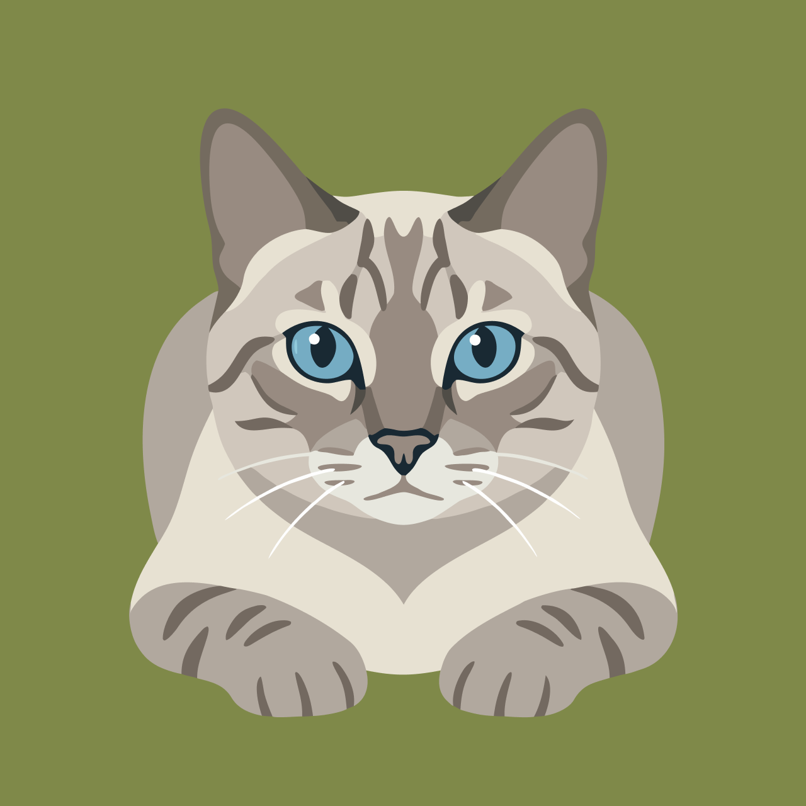

# Frajola

<p align="center">
  
</p>

<p align="center">
  <strong>Privacy-first meeting recorder. No bots. Local by default.</strong>
</p>

**Website:** [frajola.app](https://frajola.app)

## What is Frajola?

Frajola is a free, open-source desktop app that records your meetings directly from your computer's audio output and microphone — no bot joins your calls. Built with Tauri v2 (Rust backend), it transcribes audio locally with Whisper and generates AI meeting notes with Ollama. Everything runs on your machine by default.

Works with any meeting platform: Zoom, Google Meet, Teams, Discord, phone calls, in-person.

## Why Frajola?

| Feature | Frajola | Amie | Jamie | Otter.ai |
|---------|---------|------|-------|----------|
| Price | **Free** | Paid | $24/mo | $16.99/mo |
| No Meeting Bot | Yes | Yes | Yes | Partial |
| Windows | Yes | No | Yes | Yes |
| macOS | Yes | Yes | Yes | Yes |
| Linux | Yes | No | No | No |
| Local Transcription | Yes | No | Yes | No |
| Local AI Notes | Yes | No | No | No |
| Open Source | Yes | No | No | No |

## Privacy Modes

| Mode | Transcription | AI Notes | Data Leaving Device |
|------|---------------|----------|---------------------|
| **Full Local (default)** | whisper-rs | Ollama | None |
| Hybrid | whisper-rs | GPT/Claude API | Transcript text only |
| Cloud | Whisper API | GPT/Claude API | Audio + transcript |

Full Local is the default. Cloud features are opt-in and require your own API keys.

## Features

### MVP (v1.0)
- [ ] Record system audio + microphone simultaneously
- [ ] Local transcription via whisper-rs
- [ ] AI meeting notes via Ollama (local) or cloud APIs (opt-in)
- [ ] Meeting library with full-text search (FTS5)
- [ ] Export to Markdown and PDF
- [ ] **Multilingual:** English + Portugues Brasileiro
- [ ] Basic speaker change detection (VAD)
- [ ] Pause/resume recording

### v2.0 (Planned)
- [ ] ML-based speaker diarization (cloud API)
- [ ] AI Chat — ask questions about past meetings
- [ ] Calendar integration (auto-record)
- [ ] Real-time transcription
- [ ] OPUS audio encoding (smaller files)

### v3.0 (Future)
- [ ] Integrations (Notion, Slack, Linear)
- [ ] Team workspace
- [ ] Speaker memory across meetings

## Tech Stack

| Component | Technology |
|-----------|------------|
| Framework | **Tauri v2** (Rust backend + WebView frontend) |
| Frontend | React 18 + TypeScript + Tailwind CSS 4 |
| State | Zustand |
| Audio | **cpal** (cross-platform Rust audio I/O) |
| Transcription | **whisper-rs** (local, default) or OpenAI Whisper API |
| AI Notes | **Ollama** (local, default) or GPT/Claude (opt-in) |
| Database | **rusqlite** (normalized schema + FTS5 search) |
| Packaging | Tauri bundler (dmg, msi, AppImage/deb) |

## Getting Started

```bash
# Clone the repository
git clone https://github.com/victorlucss/frajola.git
cd frajola

# Install frontend dependencies
pnpm install

# Run in development (requires Rust toolchain)
pnpm tauri dev

# Build for production
pnpm tauri build
```

### Prerequisites
- [Rust](https://rustup.rs/) (latest stable)
- [Node.js](https://nodejs.org/) (18+)
- [Ollama](https://ollama.com/) (for local AI notes)
- Platform-specific: see [Tech Research](./docs/TECH_RESEARCH.md)

## Documentation

- [Architecture](./docs/ARCHITECTURE.md) — System design, DB schema, project structure
- [Product Requirements](./docs/PRD.md) — Features, timeline, technical decisions
- [Tech Research](./docs/TECH_RESEARCH.md) — Audio capture, Whisper, AI integration
- [Competitive Analysis](./docs/COMPETITIVE_ANALYSIS.md) — Market positioning

## License

MIT
